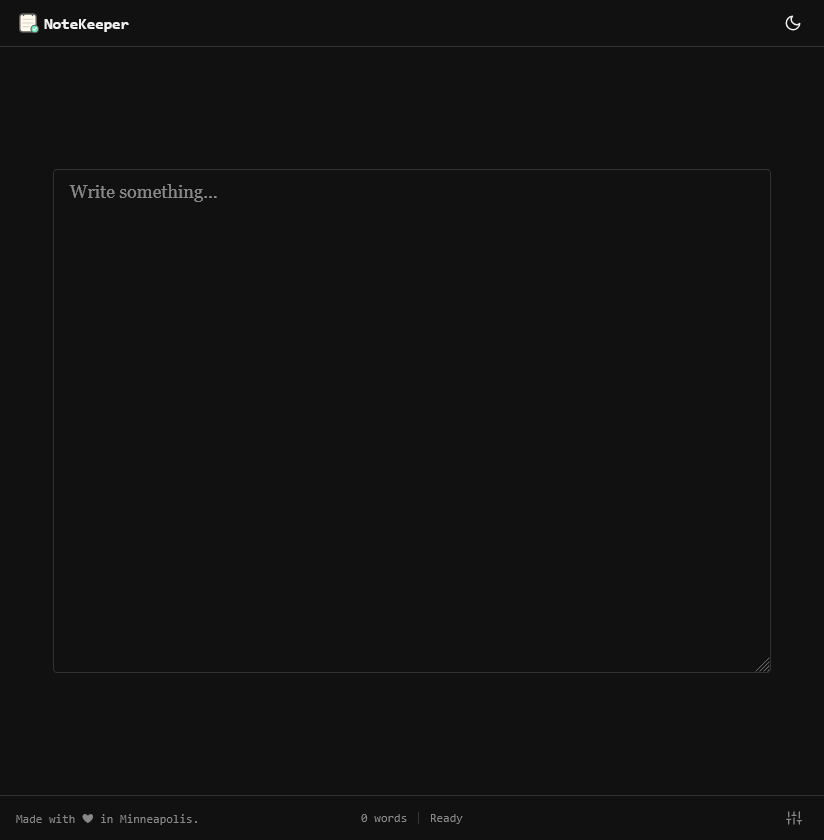
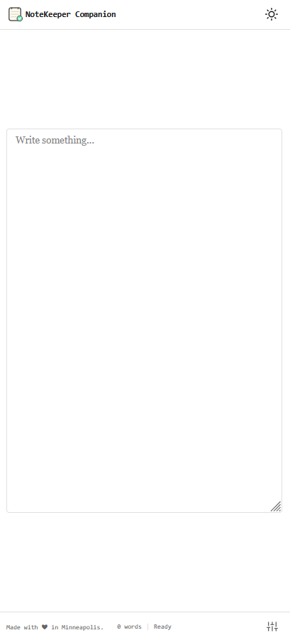

<h1> NoteKeeper</h1>

    

[NoteKeeper](https://addons.mozilla.org/en-US/firefox/addon/notekeeper/) turns your new tab into a simple text editor. Notes auto-save and sync across devices via Firefox Sync.

Install both extensions for the best experience — the [companion sidebar](https://addons.mozilla.org/en-US/firefox/addon/notekeeper-sidebar/) gives you quick access from any page.

## Features

Both extensions sync notes via Firefox Sync. But the can't share notes with each other due to some browser limitations.

### NoteKeeper (New Tab)

- Auto-saves as you type
- Syncs across devices via Firefox Sync
- Dark/light theme follows your system
- Adjustable font size
- Works offline

### NoteKeeper Sidebar (Companion)

- Opens in Firefox sidebar (Alt+Shift+N)
- Syncs with the new tab version
- Customize keyboard shortcut
- All features of NoteKeeper

## Screenshots

|  |  |
| :----------------------------------------: | :-----------------------------------------: |

## Acknowledgments

This extension is based on [Tab Notes](https://github.com/nsht/tab_notes). It hadn't received updates in over 6 years last time I checked.

## License

Available under the [MIT License](./LICENSE).
