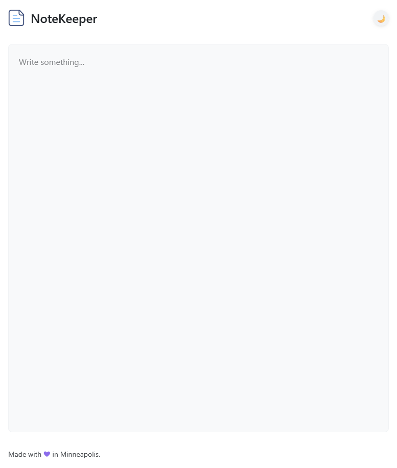
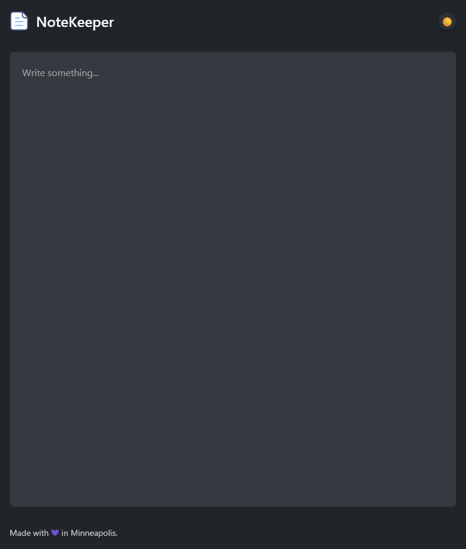

<h1> NoteKeeper</h1>

    

NoteKeeper is a Firefox extension that transforms the new tab into a minimalist, auto-saving text editor. It now comes with a new sidebar companion! If you are curious, go check out the [demo](https://semanticdata.github.io/notekeeper/).

## ✨ Features

- ✅ Auto-saves content after every keystroke
- ✅ Integrated with Firefox Sync - access your notes across browser instances
- ✅ Integrated with [Web Storage API](https://developer.mozilla.org/en-US/docs/Web/API/Web_Storage_API)
- ✅ Works offline with browser sync support ([Firefox Sync](https://www.mozilla.org/en-US/firefox/features/sync/), [Chrome Sync](https://support.google.com/chrome/answer/185277))
- ✅ Dark/Light themes with system preference detection
- ✅ Responsive design that works across devices
- ✅ Sidebar companion for quick access
- ✅ Comprehensive test coverage

## 🖼️ Screenshots

|  |  |
| :---: | :---: |

## 💜 Acknowledgments

This extension is based on [Tab Notes](https://github.com/nsht/tab_notes). It hadn't received updates in over 4 years when originally forked.

## © License

Source code in this repository is available under the [MIT License](./LICENSE).
